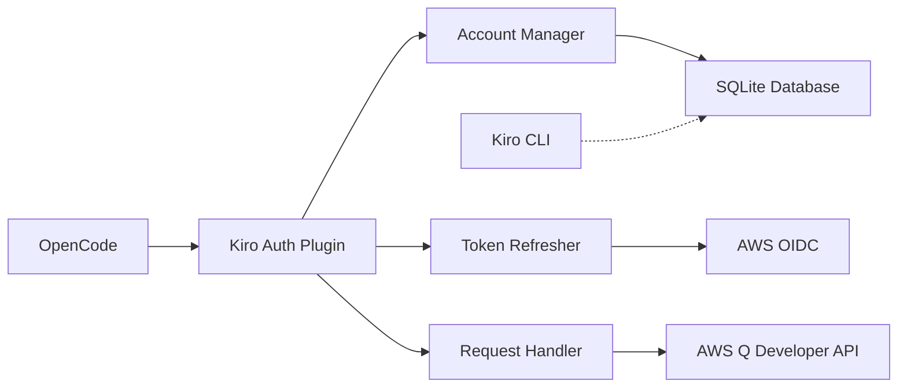

The OpenCode Kiro Auth plugin enables seamless integration between OpenCode and AWS Kiro (CodeWhisperer), providing access to Claude Sonnet, Opus, and Haiku models with substantial trial quotas.

## What is Kiro Auth?

Kiro Auth is an OpenCode plugin that implements AWS authentication for Kiro (formerly CodeWhisperer), allowing you to use Claude models through AWS infrastructure. The plugin handles the complete authentication lifecycle, token management, and intelligent account rotation.

## Key Features

<CardGroup cols={2}>
  <Card title="Multiple Auth Methods" icon="key">
    Supports AWS Builder ID (IDC), IAM Identity Center (custom Start URL), and Kiro Desktop (CLI-based) authentication
  </Card>
  
  <Card title="Auto-Sync Kiro CLI" icon="sync">
    Automatically imports and synchronizes active sessions from your local `kiro-cli` SQLite database
  </Card>
  
  <Card title="Intelligent Rotation" icon="rotate">
    Prioritizes multi-account usage based on lowest available quota with configurable strategies
  </Card>
  
  <Card title="Native Thinking Mode" icon="brain">
    Full support for Claude reasoning capabilities via virtual model mappings with configurable budgets
  </Card>
</CardGroup>

## Advanced Capabilities

### Gradual Context Truncation

The plugin intelligently prevents error 400 by reducing context size dynamically during retries. This ensures your requests succeed even when hitting context limits.

### High-Performance Storage

Efficient account and usage management using native Bun SQLite for fast read/write operations. Account data is stored locally at:

- **Linux/macOS**: `~/.config/opencode/kiro.db`
- **Windows**: `%APPDATA%\opencode\kiro.db`

### Automated Recovery

Exponential backoff for rate limits and automated token refresh ensure uninterrupted service. The plugin tracks:

- Rate limit reset times
- Token expiration with configurable buffer
- Account health status
- Automatic recovery from transient failures

## Supported Models

The plugin provides access to a wide range of Claude models:

| Model | Context | Features |
|-------|---------|----------|
| Claude Sonnet 4.5 | 200K | Text, images, PDFs |
| Claude Sonnet 4.6 | 200K | Text, images, PDFs |
| Claude Sonnet 4.6 (1M) | 1M | Extended context |
| Claude Opus 4.5 | 200K | Text, images, PDFs |
| Claude Opus 4.6 | 200K | Text, images, PDFs |
| Claude Opus 4.6 (1M) | 1M | Extended context |
| Claude Haiku 4.5 | 200K | Fast, efficient |
| Qwen3 Coder 480B | 200K | Code-focused |

<Info>
All models support thinking mode variants with configurable budgets: low (8192), medium (16384), and max (32768)
</Info>

## Architecture Overview



The plugin architecture consists of:

1. **Account Manager** - Handles account selection strategies and rotation
2. **Token Refresher** - Maintains valid tokens with automatic refresh
3. **Request Handler** - Processes API requests with retry logic
4. **Storage Layer** - Persistent SQLite database with caching
5. **Sync Engine** - Imports sessions from Kiro CLI

## Account Selection Strategies

<Tabs>
  <Tab title="Lowest Usage">
    Selects the account with the lowest usage count, ensuring even distribution across accounts:
    
    ```typescript
    {
      "account_selection_strategy": "lowest-usage"
    }
    ```
  </Tab>
  
  <Tab title="Sticky">
    Uses the same account until it hits rate limits or becomes unhealthy:
    
    ```typescript
    {
      "account_selection_strategy": "sticky"
    }
    ```
  </Tab>
  
  <Tab title="Round Robin">
    Rotates through accounts in sequence:
    
    ```typescript
    {
      "account_selection_strategy": "round-robin"
    }
    ```
  </Tab>
</Tabs>

## How It Works

<Steps>
  <Step title="Authentication">
    Authenticate via AWS Builder ID or IAM Identity Center using device flow OAuth
  </Step>
  
  <Step title="Session Management">
    Plugin stores tokens and account metadata in local SQLite database
  </Step>
  
  <Step title="Request Processing">
    Requests are routed through the account manager which selects optimal account
  </Step>
  
  <Step title="Token Refresh">
    Tokens are automatically refreshed before expiration using refresh tokens
  </Step>
  
  <Step title="Usage Tracking">
    Usage limits are synced periodically and displayed via toast notifications
  </Step>
</Steps>

## Why Use Kiro Auth?

<CardGroup cols={2}>
  <Card title="Cost Effective" icon="dollar-sign">
    Substantial trial quotas available through AWS Builder ID
  </Card>
  
  <Card title="Enterprise Ready" icon="building">
    Full IAM Identity Center support for organizational accounts
  </Card>
  
  <Card title="Zero Config" icon="wand-magic-sparkles">
    Auto-sync with Kiro CLI means minimal setup required
  </Card>
  
  <Card title="Battle Tested" icon="shield-check">
    Robust error handling and automatic recovery mechanisms
  </Card>
</CardGroup>

## Next Steps

<CardGroup cols={2}>
  <Card title="Installation" icon="download" href="/installation">
    Install the plugin and configure OpenCode
  </Card>
  
  <Card title="Quickstart" icon="rocket" href="/quickstart">
    Get started with authentication and make your first API call
  </Card>
</CardGroup>

## Acknowledgements

Special thanks to [AIClient-2-API](https://github.com/justlovemaki/AIClient-2-API) for providing the foundational Kiro authentication logic and request patterns.

<Warning>
This plugin is provided strictly for learning and educational purposes. It is an independent implementation and is not affiliated with, endorsed by, or supported by Amazon Web Services (AWS) or Anthropic. Use of this plugin is at your own risk.
</Warning>